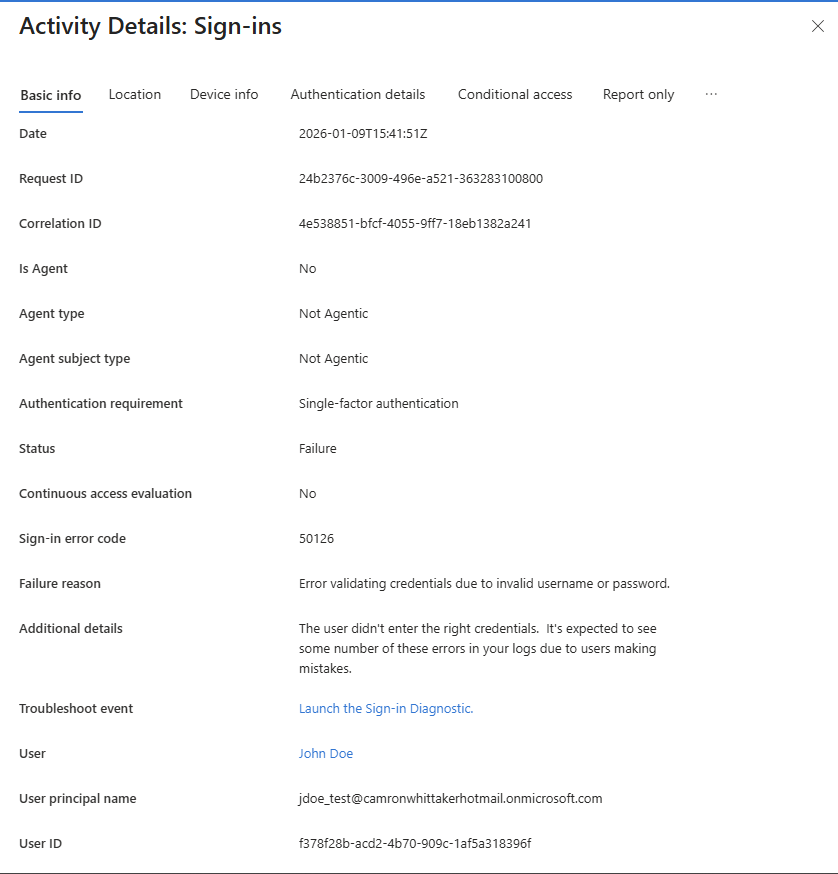
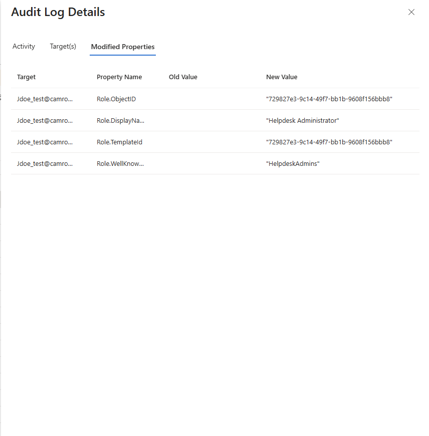

# Cloud IAM Incident Investigation – Azure Entra ID

## Overview
This repository documents a cloud identity investigation using **Azure Entra ID**.  
The lab simulates suspicious authentication activity against a privileged identity and walks through investigation, analysis, and remediation from a SOC analyst perspective.

The focus is on **identity-based threats**, not tooling complexity.

---

## Scenario Summary
A test Azure Entra ID user was assigned a role and later observed generating repeated failed authentication attempts. The investigation correlates **sign-in telemetry** with **audit logs** to assess risk and identify gaps in identity lifecycle management.

This mirrors real-world SOC investigations involving:
- Credential misuse
- Password guessing
- Incomplete offboarding
- Privileged identity risk

---

## Environment
- Identity Platform: **Azure Entra ID**
- Log Sources:
  - Sign-in logs
  - Audit logs
- Test Account: `jdoe_test`

---

## Identity Lifecycle Events

### 1. Joiner
- User account `jdoe_test` created
- Successful baseline sign-in performed
- Sign-in event recorded in Azure Entra sign-in logs

### 2. Mover (RBAC Change)
- A low-risk administrative role assigned to the user
- Role assignment confirmed via Azure Entra audit logs
- Privileged context established for the account

### 3. Suspicious Activity
- Multiple failed authentication attempts generated using incorrect passwords
- Events logged in Azure Entra sign-in logs
- Attempts occurred while the account retained role-based access

---

## Detection & Evidence

### Detection Source
- **Azure Entra ID Sign-in Logs**

### Indicators Observed
- Repeated failed sign-in attempts
- Consistent user target (`jdoe_test`)
- Browser-based authentication attempts
- Privileged role context at time of activity

### Correlated Logs
- **Sign-in logs** confirmed authentication failures
- **Audit logs** confirmed role assignment prior to failed attempts

This correlation increased severity and risk classification.
## Evidence

### Failed Sign-In Activity
The following screenshot shows repeated failed authentication attempts for the test user `jdoe_test` captured in Azure Entra ID sign-in logs.

---

### Role Assignment Audit Log
This screenshot confirms the role assignment for the same user prior to the failed sign-in activity, increasing the risk context of the event.

---

## Analysis
Repeated failed sign-ins against a privileged identity may indicate:
- Password guessing
- Credential stuffing
- Attempted unauthorized access

The presence of a role assignment increases potential impact if authentication were successful.  
This highlights the importance of identity monitoring and clean offboarding procedures.

---

## Impact & Risk
- Potential privilege abuse if authentication succeeds
- Increased attack surface due to retained access
- Identity-based threats bypass traditional perimeter controls

---

## Remediation
- Remove unnecessary role assignments
- Reset credentials for affected account
- Review recent sign-in activity for other privileged users
- Validate offboarding and access governance procedures

---

## Prevention Recommendations
- Enforce Joiner/Mover/Leaver (JML) automation
- Require MFA and Conditional Access for privileged roles
- Implement alerting for failed sign-in bursts
- Conduct regular access reviews of administrative roles

---

## Key Takeaways
- Identity telemetry requires correlation between **authentication activity** and **access changes**
- Privileged identities elevate severity of common authentication failures
- Cloud IAM investigations are a core SOC function in modern environments

---

## Skills Demonstrated
- Cloud IAM investigation
- Azure Entra ID sign-in log analysis
- Audit log correlation
- SOC-style incident documentation
- Risk assessment and remediation planning
